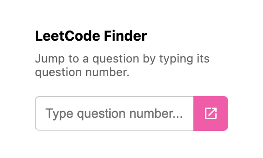

# leetcode-question-finder


Jump to a LeetCode question using its question number.



## Prerequisites

* [node.js](https://nodejs.org/) + [yarn](https://yarnpkg.com/)

## Setup

```
yarn install
```

## Build

```
yarn build
```

## Build in watch mode

### terminal

```
yarn watch
```

## Test

```
yarn test
```
